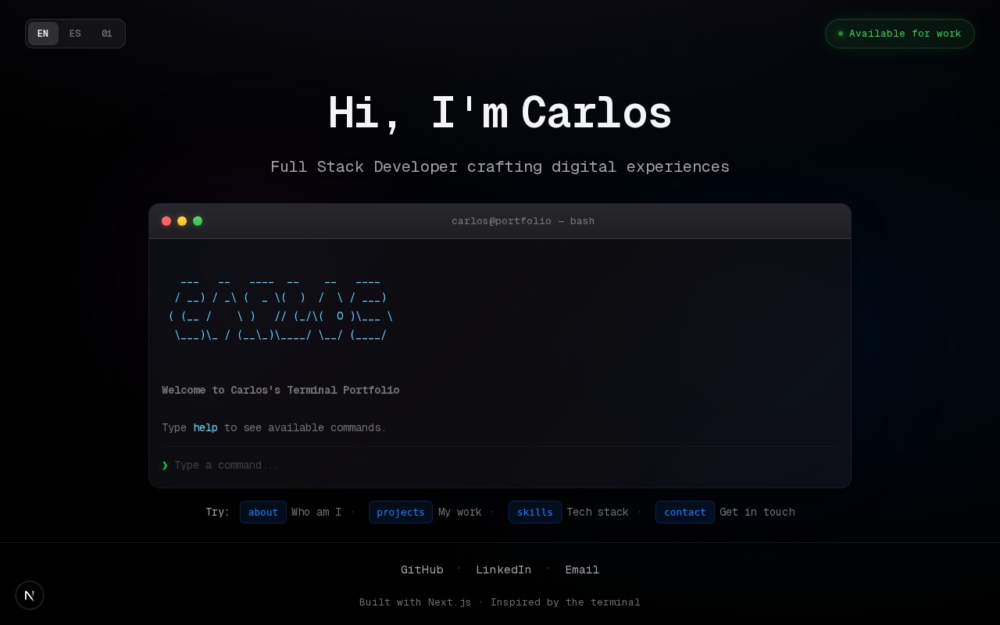
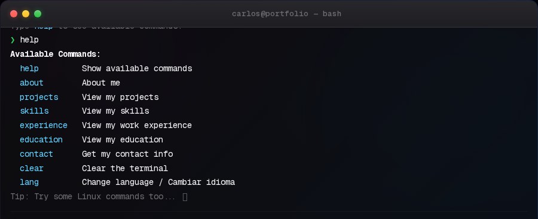
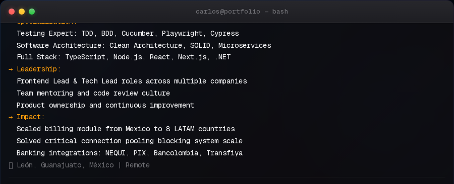
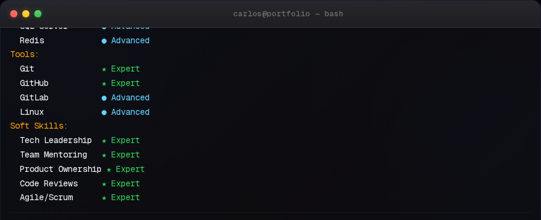
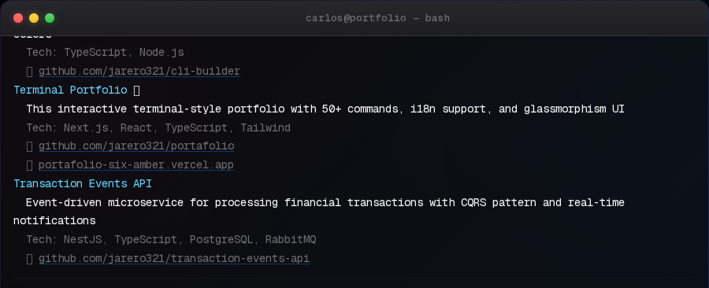

<div align="center">

```
                  _    __       _ _
 _ __   ___  _ __| |_ / _| ___ | (_) ___
| '_ \ / _ \| '__| __| |_ / _ \| | |/ _ \
| |_) | (_) | |  | |_|  _| (_) | | | (_) |
| .__/ \___/|_|   \__|_|  \___/|_|_|\___/
|_|
```

### I wanted my portfolio to feel like a terminal. So I built one.


[](LICENSE)

**Interactive terminal-style portfolio with 58+ commands, i18n support, and glassmorphism UI**

[Live Demo](https://jarero.dev) · [Features](#features) · [Commands](#commands) · [Customization](#customization)

</div>

---



## Features

| Feature | Description |
|---------|-------------|
| **Terminal UI** | Authentic terminal experience with typing effects and ANSI color support |
| **58+ Commands** | Portfolio, Linux-style, dev jokes, and easter eggs |
| **i18n Support** | English, Spanish, and Binary (`01001...`) language modes |
| **Glassmorphism** | macOS-inspired design with blur effects and floating orbs |
| **Responsive** | Optimized for desktop and mobile |
| **Keyboard Shortcuts** | Tab completion, history navigation, Ctrl+L/C |

## Commands

### Portfolio Commands



| Command | Description |
|---------|-------------|
| `help [cmd]` | Show available commands or help for specific command |
| `about` | Personal info, specializations, leadership, and impact |
| `skills [--category=X]` | Technical skills across 8 categories (42 skills) |
| `projects [--featured]` | Portfolio projects with tech stack and links |
| `experience` | Work history (5 positions) |
| `education` | Academic background |
| `contact` | Email, GitHub, LinkedIn, website |

<details>
<summary><strong>about</strong> — Bio, specializations, and impact</summary>



</details>

<details>
<summary><strong>skills</strong> — 42 skills across 8 categories</summary>



Categories: `frontend`, `backend`, `testing`, `architecture`, `cloud`, `database`, `tools`, `soft`

</details>

<details>
<summary><strong>projects --featured</strong> — Featured projects with links</summary>



</details>

### System Commands

| Command | Description |
|---------|-------------|
| `clear` | Clear terminal |
| `lang [en\|es\|bin]` | Change language |
| `ls [-a]`, `pwd`, `whoami` | Linux-style commands |
| `cat`, `echo`, `date`, `uptime` | Standard utilities |
| `neofetch`, `top`, `ping`, `curl` | System info |
| `vim`, `nano`, `grep`, `sudo` | Editor & tools |

### Easter Eggs & Dev Humor

| Command | Description |
|---------|-------------|
| `coffee` | Virtual coffee break |
| `matrix` | Enter the Matrix |
| `cowsay [msg]` | ASCII cow |
| `fortune` | Random dev wisdom |
| `git`, `npm`, `docker` | Dev tool jokes |
| `deploy`, `css`, `js` | Programming humor |
| `hack` | Fake hacking sequence |

## Quick Start

```bash
# Clone
git clone https://github.com/jarero321/portafolio.git
cd portafolio/portfolio-web

# Install
npm install

# Run
npm run dev
```

Open [http://localhost:3000](http://localhost:3000)

## Project Structure

```
src/
├── app/[locale]/        # Next.js App Router + i18n (en/es/bin)
├── components/Terminal/  # Terminal UI components
│   ├── Terminal.tsx      # Main wrapper with auto-scroll
│   ├── TerminalHeader.tsx # macOS-style title bar
│   ├── TerminalInput.tsx  # Input with prompt and auto-focus
│   └── TerminalLine.tsx   # ANSI color parser and URL detection
├── lib/
│   ├── commands/         # Command implementations
│   │   ├── main.ts       # Portfolio commands (9)
│   │   ├── linux.ts      # Linux-style commands (22)
│   │   ├── fun.ts        # Easter eggs (9)
│   │   ├── devJokes.ts   # Dev humor (15)
│   │   └── language.ts   # Language switcher (2)
│   ├── hooks/            # useTerminal hook
│   └── i18n.ts           # Translations (30+ keys)
├── data/portfolio.ts     # Your data here
└── types/                # TypeScript types
```

## Customization

### Edit Your Data

Update `src/data/portfolio.ts`:

```typescript
export const portfolio = {
  name: 'Your Name',
  title: 'Your Title',
  bio: 'Your bio...',

  skills: [
    { name: 'TypeScript', level: 90, category: 'frontend' }
  ],

  projects: [
    { name: 'Project', description: '...', tech: ['Next.js'], featured: true }
  ],

  experience: [
    { company: 'Company', role: 'Role', period: '2024', description: '...' }
  ]
}
```

### Add Custom Commands

Create `src/lib/commands/custom.ts`:

```typescript
import { registry } from './registry';

registry.register({
  name: 'hello',
  description: 'Say hello',
  execute: () => ({ output: 'Hello, World!' })
});
```

Import in `src/lib/commands/index.ts`.

## Screenshots

Generate screenshots with Playwright:

```bash
npm run screenshots
```

Output: `public/screenshots/*.png`

## Tech Stack

- **Framework**: Next.js 16 (App Router)
- **UI**: React 19
- **Styling**: Tailwind CSS 4 + custom glassmorphism CSS
- **Language**: TypeScript 5 (strict mode)
- **Font**: Geist Mono
- **Testing**: Playwright

## Deployment

[](https://vercel.com/new/clone?repository-url=https://github.com/jarero321/portafolio)

## License

MIT

---

<div align="center">

**[Report Bug](https://github.com/jarero321/portafolio/issues)** · **[Request Feature](https://github.com/jarero321/portafolio/issues)**

</div>
